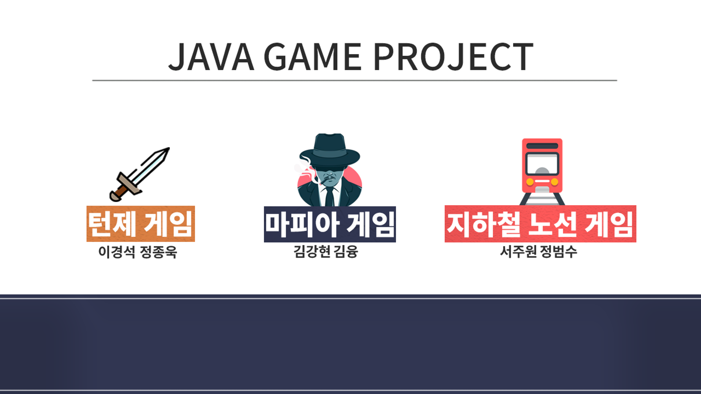
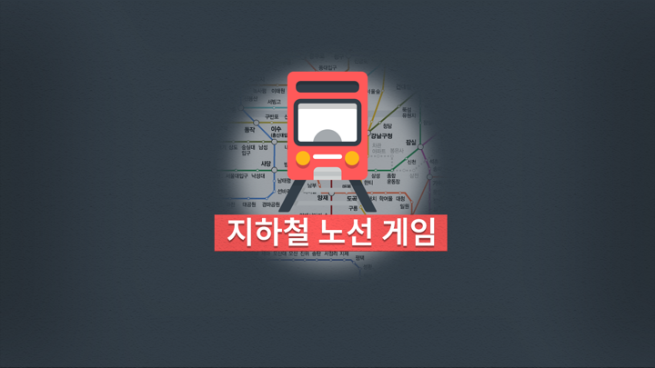
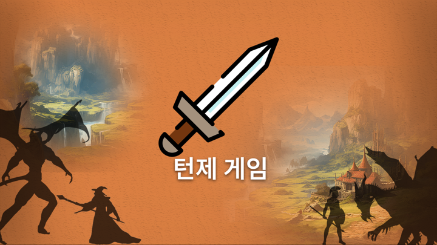
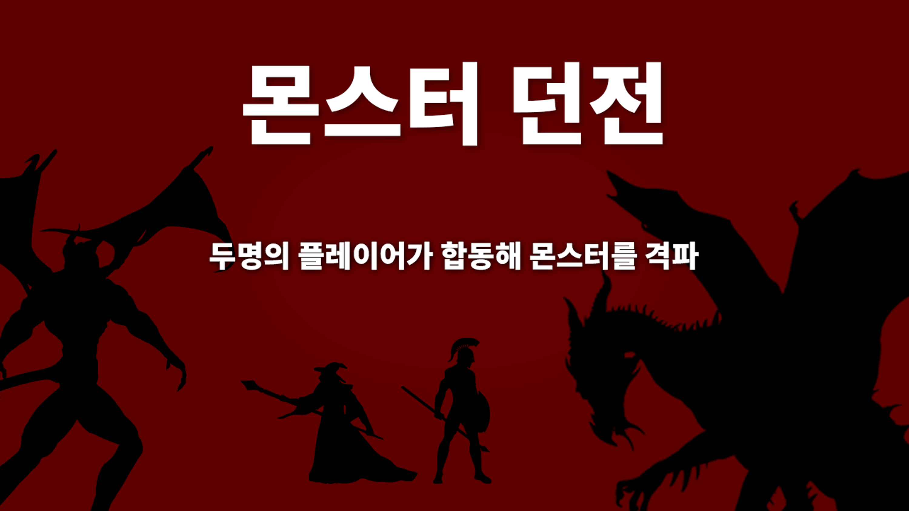
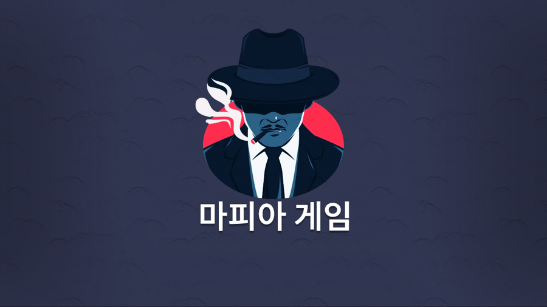

## Mini Game Project

3가지의 미니게임의 2명이서 짝을 지어서 게임을 구현하는 것을 목표로 하였습니다.

**네이버 클라우드 캠프 클라우드 기반 웹 데브옵스 개발자 과정 8기  
개발기간: 2024-02-19 ~ 2024-02-26(8일)**

## 프로젝트 소개

자세한 설명은 상세 기능 설명란에서 각 항목을 참조

### 1. 지하철 노선 게임

    

1. 플레이어가 게임에 입장
2. 게임 진행할 호선 번호를 플레이어가 입력
3. 선택한 호선의 역 이름을 반복 입력
4. 시간 초과, 이미 입력한 역 이름을 다시 입력하면 게임 종료

### 2. 턴제 게임

    
    

1. 2명의 플레이어가 모이면 게임 시작
2. 랜덤한 몬스터가 등장
3. 각자 자신의 턴에 따라서 행동(Player1 -> Monster -> Player2 -> Monster)
4. 플레이어측 전멸 혹은 몬스터의 HP가 0이 될 때 까지 3번 항목 반복

### 3. 마피아 게임

    

1. 총 7명의 플레이어가 모이면 게임 시작
2. 마피아 2명, 의사 1명, 경찰 1명, 시민 3명
3. 낮에는 투표로 1명 추방
4. 밤에는 각자의 역할 수행 후 처리
5. 각자의 승리 조건 중 하나가 만족할 때까지 3,4번 항목 반복

## ⚙ 공통 개발환경

### 💻 Client Development

#### Language

### 🌐 Backend Development

#### Language

 
 
#### Database

#### collaboration tool

## 📌 상세 기능 설명

### [지하철 게임(서주원, 정범수)](https://github.com/maruduke/bitcamp-project1/blob/main/SubwayGame/Readme.md)

### [턴제 게임(정종욱, 이경석)](https://github.com/maruduke/bitcamp-project1/blob/main/Turn-based/Readme.md)

### [마피아 게임(김강현, 김융)](https://github.com/maruduke/bitcamp-project1/blob/main/MafiaGame/Readme.md)
