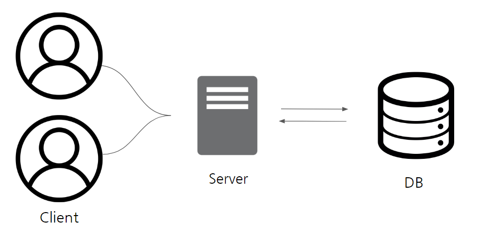
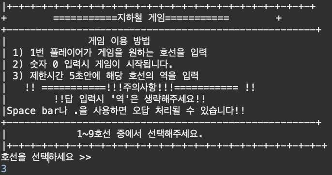
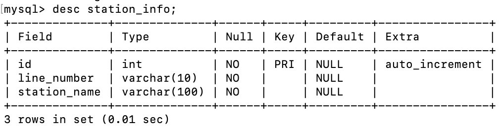
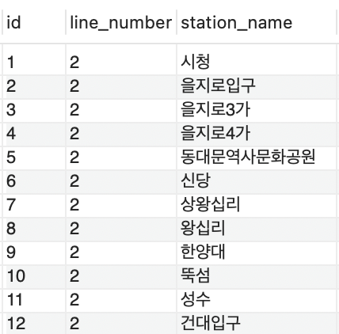
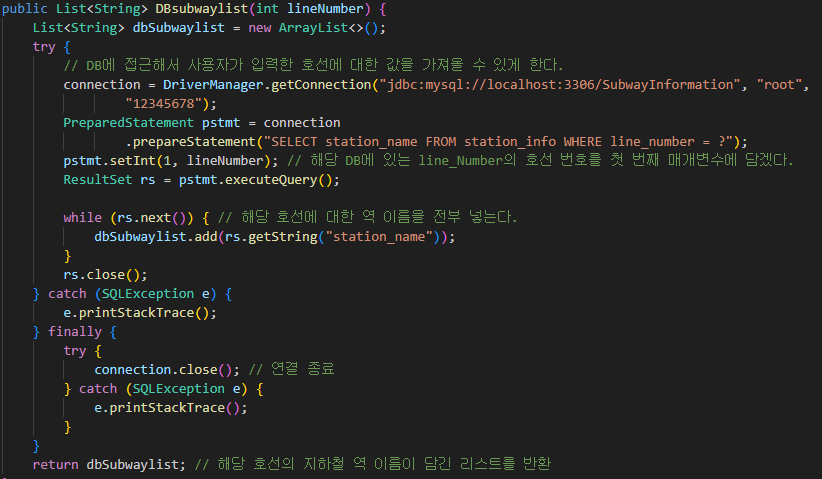
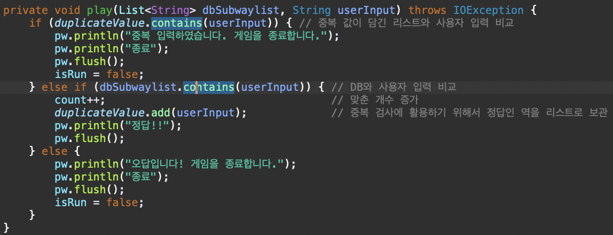
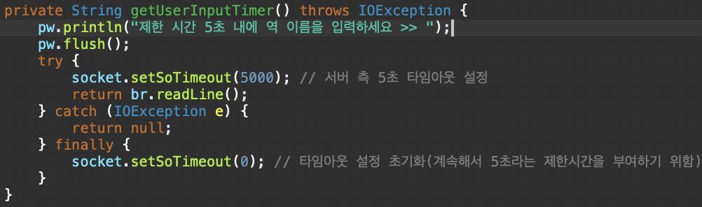

## 기본 설계

  

- 2명의 Client가 각각 Server에 접속
- Server는 Client와 통신하며 게임 로직 실행
- DB는 지하철 노선과 그 노선에 해당하는 역 정보 저장

## 역할 분담

### 정범수
- Server 

  Server -> Client로 전송되는 Message 관리
  
  게임 진행에 필요한 스레드 및 서버 측 시간제한 기능 구현
  

- DB
  line_number(호선), station_name(역 이름) 데이터 저장

### 서주원
- Server
  Client, Server, DB와 연결 관리

- Client

  사용자 값 입력 및 Client측 시간 제한 기능 구현
  Client -> Server로 전송되는 Message 관리

## Client 

  

### 기능

클라이언트가 수행하는 기능은 크게 2가지로 나뉜다.
1. 게임 시작 시 메뉴화면을 보고 게임을 진행할 호선을 입력
2. 해당 호선에 대한 역 이름을 5초안에 입력

## DB
지하철의 총 개수를 확인하기 위해 ID, 호선을 구별하기 위해 line_number, 역 이름을 저장하기 위한 station_info로 저장한다.

  

  

## Server
DB와 연결하는 부분

  

### 기능

1. Client가 선택한 호선을 가져온다.
2. 해당 호선에 대한 값을 DB로부터 가져온다.
3. Client가 입력한 값과 DB의 값과 비교한다.
4. 이때 서버 측에서도 5초라는 시간제한을 부여한다.
5. 만약 입력 값이 정답일 경우 3번으로 되돌아간다.
6. 게임이 종료될 때 Client가 맞춘 정답의 개수를 확인한다.

## 게임 로직

  

  

- Client -> Server -> DB -> Server -> Client 순으로 로직을 수행한다. 
- 만약 중복된 값을 입력하거나 오답, 제한 시간안에 입력을 안할 경우 프로그램을 종료한다.

