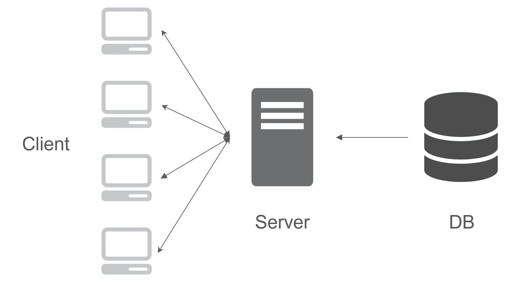
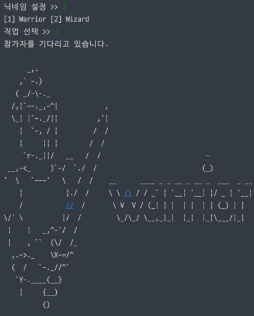
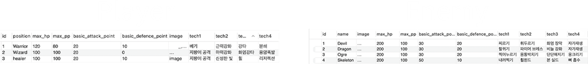
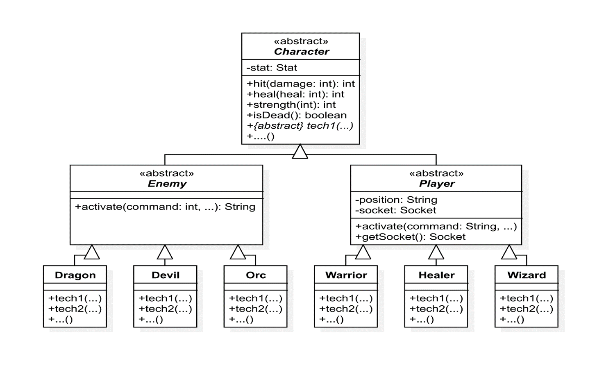
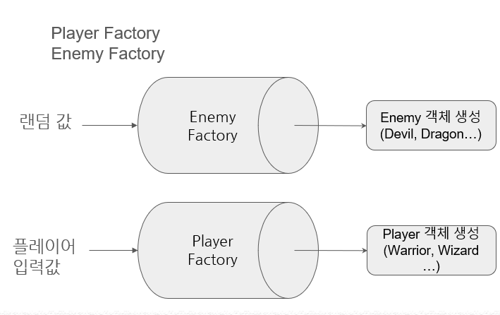
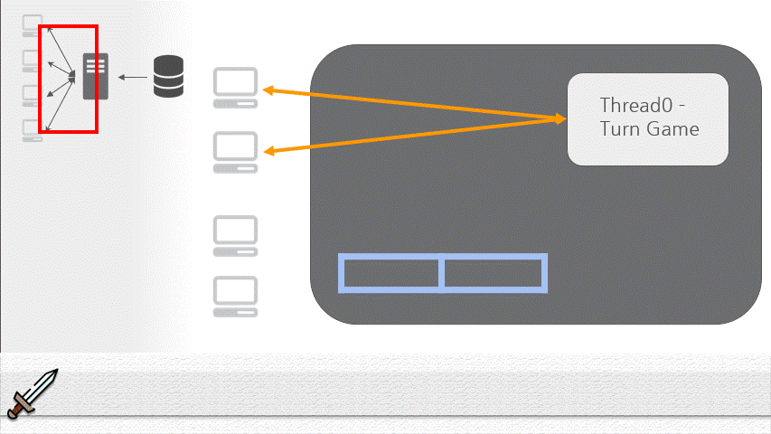

## 아키텍처

<p align="center">
    
</p>

-   다수의 Client가 Server에 접속
-   Server는 Client와 통신하며 턴제 게임 로직을 수행하는 Thread와 통신
-   DB는 player와 monster에 대한 기본적인 정보를 저장함

## 역할 분담

### 정종욱

-   Client
    -   Server와 Client사이의 전송할 JSON 통신 담당
-   Server
    -   서버에서 클라이언트로 전송되는 Message 관리
-   DB
    -   Player, Enemy Table 생성 및 데이터 추가
    -   Server와 DB 연결 및 데이터 매핑

### 이경석

-   Server
    -   Client와 Server의 접속 관리
    -   서버 데이터 저장 구조 설계
    -   게임 로직 생성 및 Thread 관리

## 🖥️ Client

<p align="center">
    
</p>

### 기능

클라이언트가 가지고 있는 기능은 크게 2가지이다.

1.  클라이언트는 서버에서 `실시간으로 전송된 패킷을 파싱하여 콘솔에 출력`한다. 패킷의 내부의 데이터는 플레이어나 적의 이미지와 hp등의 정보를 가지고 있다.

2.  클라이언트는 서버로 닉네임과 직업 설정을 최초로 입력받고 게임이 시작되면 player 캐릭터의 행동을 지시하는 Command 정보를 자신의 턴에 입력한다.

## 🛢 DB



### Player Table

해당 테이블에는 플레이어가 선택한 직업의 기본 hp,mp, 공방, 플레이어 이미지와 기술명 등이 저장되어 있다.

| data                | dataType | description       |
| ------------------- | -------- | ----------------- |
| Id                  | number   | 구별자            |
| position            | varchar  | 직업 ex\) Warrior |
| max_hp              | number   | hp 총량           |
| max_pp              | number   | MP 총량           |
| basic_attack_point  | number   | 공격력            |
| basic_defence_point | number   | 방어력            |
| image               | varchar  | 아스키코드 이미지 |
| tech1               | varchar  | 기술명1           |
| tech2               | varchar  | 기술명2           |
| tech3               | varchar  | 기술명3           |
| tech4               | varchar  | 기술명4           |

### Enemy Table

Enemy 테이블의 경우 전반적으로 Player테이블과 동일하나 직업을 나타내는 Position이 없고 몬스터의 이름을 나타내는 name이 존재한다.

| data                | dataType | description       |
| ------------------- | -------- | ----------------- |
| Id                  | number   | 구별자            |
| name                | varchar  | 몬스터 이름       |
| max_hp              | number   | hp 총량           |
| max_pp              | number   | MP 총량           |
| basic_attack_point  | number   | 공격력            |
| basic_defence_point | number   | 방어력            |
| image               | varchar  | 아스키코드 이미지 |
| tech1               | varchar  | 기술명1           |
| tech2               | varchar  | 기술명2           |
| tech3               | varchar  | 기술명3           |
| tech4               | varchar  | 기술명4           |

## 🗄️ Server

1. DB 연결 데이터 저장 부분
 <p align="center">
     
 </p>

### Character abstract Class

-   서버는 DB에서 데이터를 받아와 Chracter의 필드값인 Stat 클래스에 전부 저장된다.
-   해당 데이터는 3계층의 추상 클래스로 구성되어 있다. 최상위 추상 클래스인 Character에 DB에서 가져온 `캐릭터의 기본적인 정보`와 `공통된 메서드(데미지 처리, 회복, 강화, 캐릭터 사망 체크 등...)`가 정의되어 있다.

-   하위 계층에서는 `Enemy, Player 추상 클래스 2가지로 분화`된다.

### Enemy abstract Class

-   Enemy 클래스는 activate 메서드를 가지고 있다. 해당 메서드는 행동할 경우 실행되며 비슷한 기능을 Player도 가지고 있지만 서로 타겟 이 되는 대상이 다르므로 메서드를 분리하였다.

### Player abstract Class

-   Player계층은 `서버와 클라이언트의 연결 정보`인 Socket 필드 값을 추가로 가지고 있다.

### 실제로 생성될 객체 계층

-   3계층은 실제 클래스로 해당 구조를 통해 새로운 Enemy나 Player를 만들어 낼 경우 `상속을 받은 후 기술 메서드만 구현`하는 것으로 간단히 구현할 수 있다.

-   위의 설명한 객체들은 아래 그림의 `Factory 클래스`를 통해서 간단히 생성할 수 있다.

2. Player, Enemy 객체 생성
 <p align="center">
     
 </p>

-   팩토리 클래스를 통해 EnemyFactory는 랜덤 값을 입력받아서 PlayerFactory는 사용자가 입력한 Position 정보에 따라 다양한 종류의 Enemy, Player 객체가 생성됨.

3. Server와 Client 통신
    <p align="center">
        
    </p>

    1. Player1 이 서버와 통신을 시작하면 서버는 List에 소켓 정보를 저장하고 대기한다.
    2. Player2 가 서버와 통신한다면 서버는 마찬가지로 List에 소켓 정보를 저장한다.
    3. 게임을 시작하기 위한 2명의 Player를 들어왔음을 확인 후 게임을 시작하기 위해 `새로운 Game로직을 담고 있는 Thread`를 생성한다.
    4. 해당 Thread에 연결된 2명의 Player의 소켓 정보를 넘겨주고 게임을 실행하여 클라이언트와 소통을 담당한다.
    5. 서버는 소켓 정보를 저장하고 있는 리스트를 비우고 다른 클라이언트의 접근을 대기한다.

## Game Logic

-   게임 로직은 Thread 내부에서 실행되어 멀티 쓰레드로서 작동하게 된다.
-   `2명의 Player의 소켓 정보`를 입력 받는다.

```java
class GameStart implements Runnable {
    List<Socket> sockets;
    Game poketmon;
    public GameStart(List<Socket> sockets, Poketmon poketmon) {
        this.sockets = sockets;
        this.poketmon = poketmon;
    }

    @Override
    public void run() {
        try {
            poketmon.enterRoom(sockets); // 2명의 Player 소켓 정보를 입력
            poketmon.start();
        } catch (Exception e) {
            e.printStackTrace();
        }
    }
}
```

-   Player1 -> Monster -> Player2 -> Monster 순으로 행동을 반복한다.
-   플레이어 전멸하거나 몬스터가 HP가 0이 될 때 게임을 종료하며 승패에 따라 결과가 반환된다.
